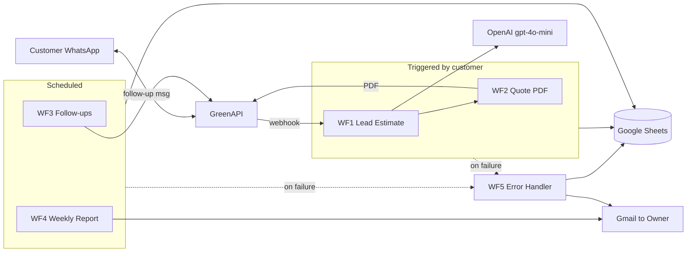

# Architecture

```mermaid
flowchart LR
    C[Customer WhatsApp] <-->|messages| G[GreenAPI]

    subgraph REACT[Triggered by customer]
        WF1[WF1 Lead Estimate] --> WF2[WF2 Quote PDF]
    end

    subgraph SCHED[Scheduled]
        WF3[WF3 Follow-ups]
        WF4[WF4 Weekly Report]
    end

    G -->|webhook| WF1
    WF2 -->|PDF| G
    WF3 -->|follow-up msg| G
    WF1 --> AI[OpenAI gpt-4o-mini]

    REACT --> S[(Google Sheets)]
    SCHED --> S
    WF4 --> M[Gmail to Owner]

    REACT -.->|on failure| WF5[WF5 Error Handler]
    SCHED -.->|on failure| WF5
    WF5 --> M
    WF5 --> S
```